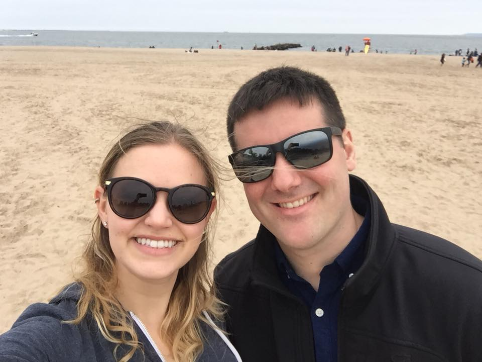

## Hi, I'm Nicole

My name is Nicole Comfort. I was born and raised in Middlesex County in Massachusetts and so am an obnoxious New England sports fan by default (Go Sox!). If I'm not wearing Boston sports T-shirts, you'll find me in some free swag I got in college. In 2015 I graduated from Northeastern University (Boston, MA) with a B.S. in Behavioral Neuroscience. 
 
(add image later)

I come from a big, loud family and like to visit them as much as I can! 

(add image later) 

On the first day of fall this year, I got engaged to my best friend and boyfriend of ten years. I must say, wedding planning is fun but awfully distracting from school and research! 

(add image later) 

## I'm a PhD student

That's right, I'm (still) in school. I'm a third year PhD student at Columbia University studying Environmental Health Science. 

My research interests are: 

## Oh, and I'm a dog mom

As if life wasn't hectic enough, I have my two dogs here with me in NYC. 

Note: Jeff usually makes a folder that will contain all the images we want to put online. 
Also, this is probably the only case where he messes with HTML rather than add images using the R markdown. 

Add an image on my own: 

 

Note that without the ./ to denote current working directory works also. 

## Add me on social media and follow my research

[Linkedin](https://www.linkedin.com/in/nicole-comfort/) 

[ResearchGate](https://www.researchgate.net/profile/Nicole_Comfort)

[My NCBI Bibliography](https://www.ncbi.nlm.nih.gov/sites/myncbi/1v5L4VkrjtH55/bibliography/51939750/public/?sort=date&direction=ascending) 

[Github](https://github.com/ncomfort) 

[Publons](publons.com/a/1543846/)

## Contact me

Email: add my email link 
