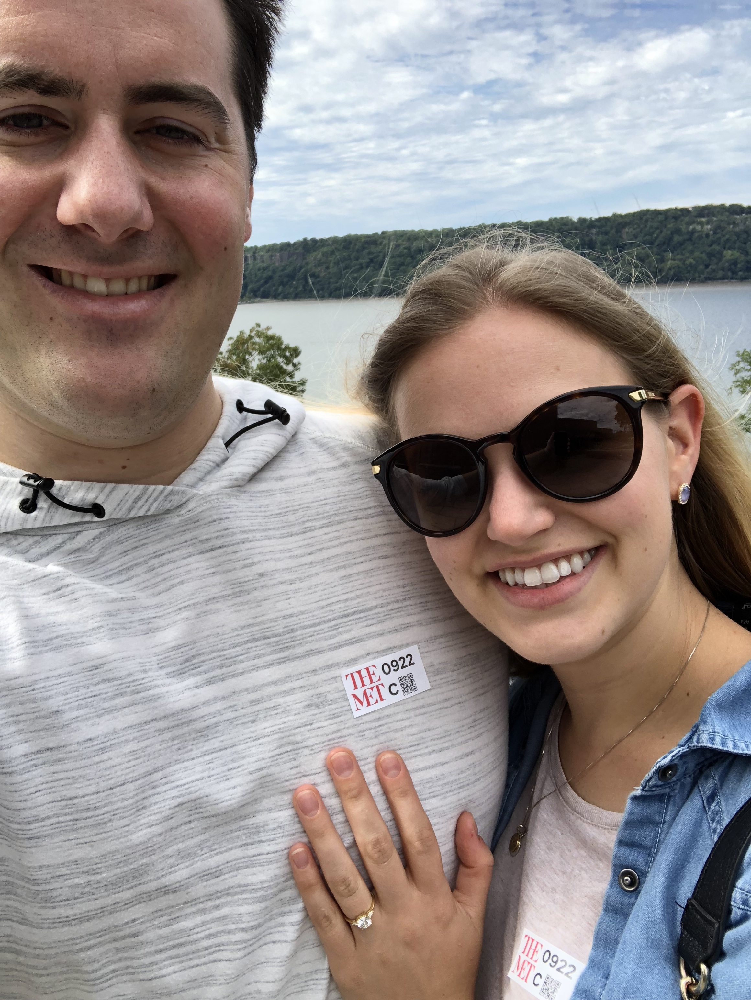

## Hi, I'm Nicole

My name is Nicole Comfort. I was born and raised in Middlesex County in Massachusetts and so am an obnoxious New England sports fan by default (Go Sox!). If I'm not wearing Boston sports T-shirts, you'll find me wearing some free swag I got in college. In 2015 I graduated from Northeastern University (Boston, MA) with a B.S. in Behavioral Neuroscience. 

I come from a big, loud family and like to visit them as much as I can! 

On the first day of fall this year, I got engaged to my best friend and boyfriend of ten years. I must say, wedding planning is fun but awfully distracting from school and research! 

## I'm a PhD student

That's right, I'm (still) in school. I'm a third year PhD student at Columbia University studying Environmental Health Science. 

I'm interested in researching the impact of environmental pollutants and toxicants on the brain and corresponding neurological and behavioral outcomes. For example, I'm interested in the potential contribution to neurodevelopmental and neurodegenerative disorders such as autism and amyotrophic lateral sclerosis and the mechanisms by which exposures cause disease.

## Oh, and I'm a dog mom

As if life wasn't hectic enough, I have my two dogs here with me in NYC:

This one is named Andy:

And this is his brother, Rocco: 

## Follow my research and contributions to science

[My NCBI Bibliography](https://www.ncbi.nlm.nih.gov/sites/myncbi/1v5L4VkrjtH55/bibliography/51939750/public/?sort=date&direction=ascending) 

[Publons](publons.com/a/1543846/)
