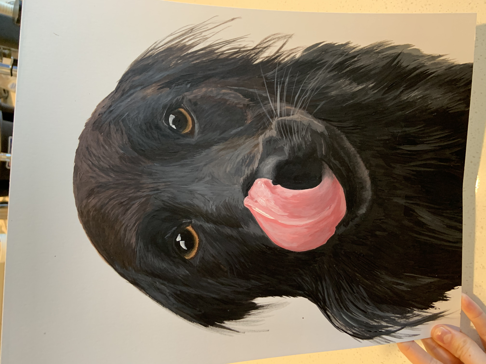
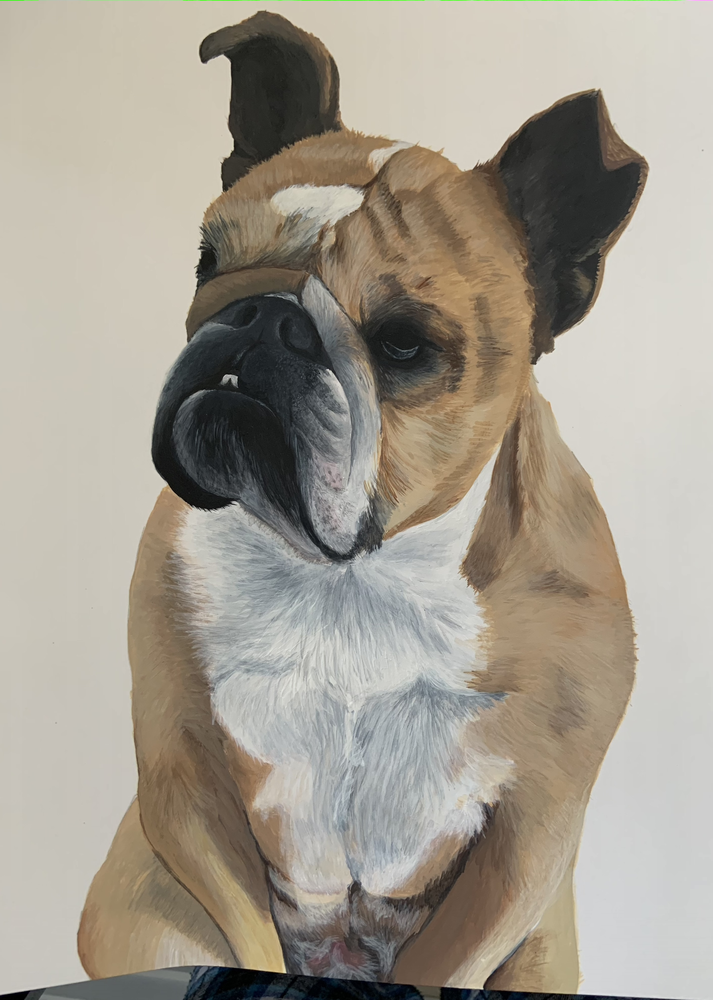
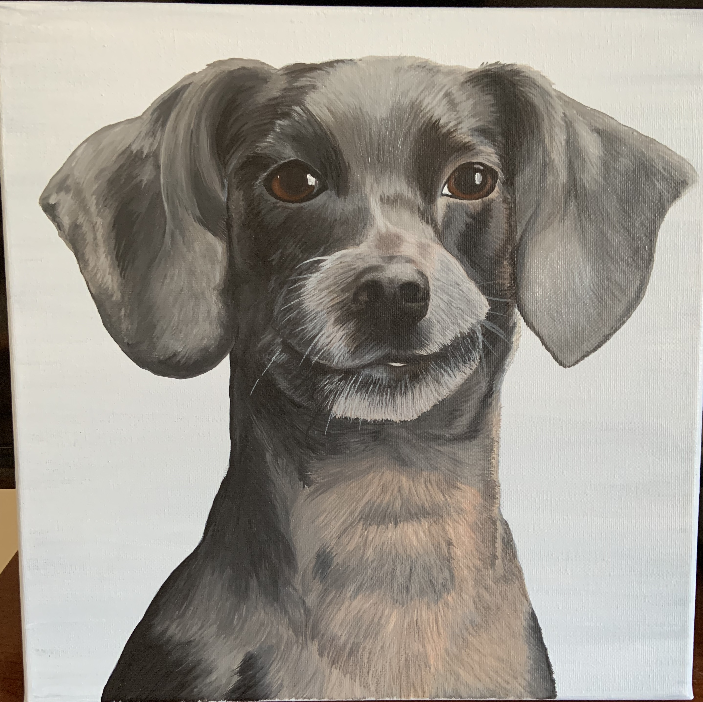
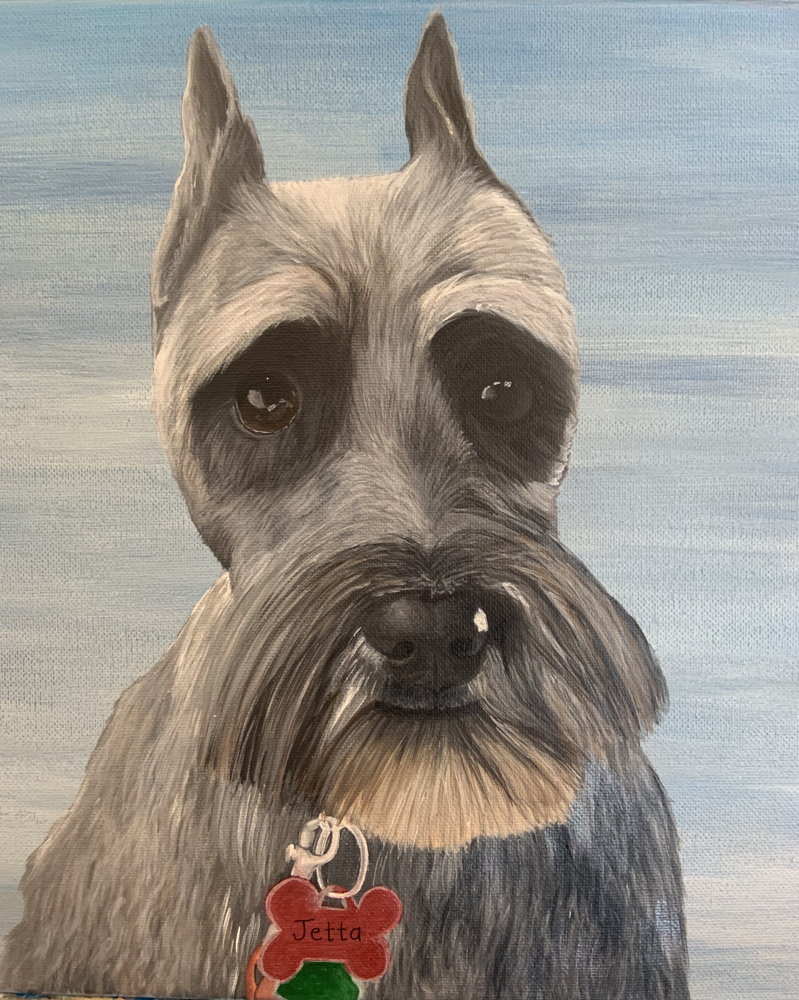
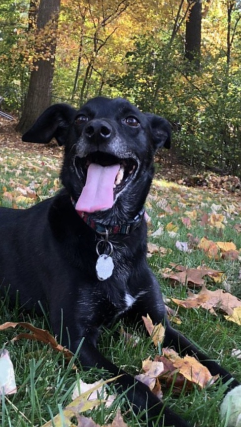
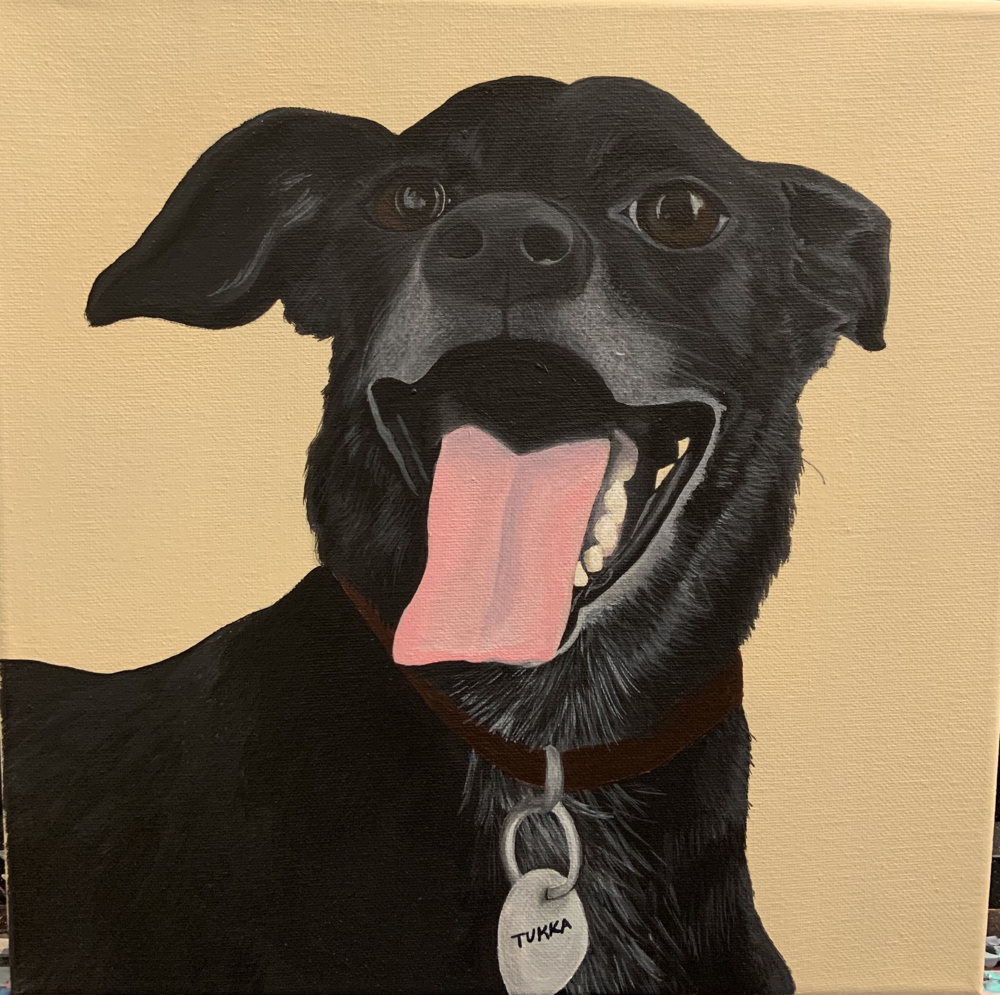
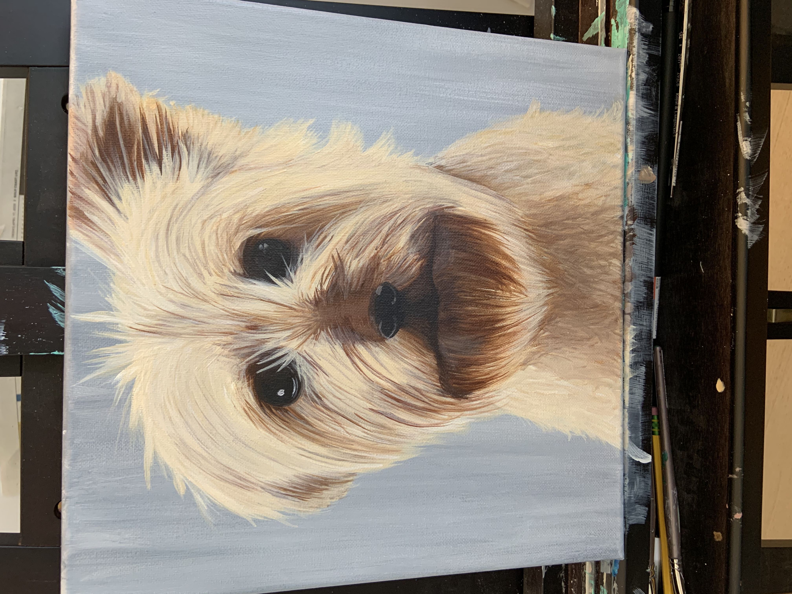

<link rel="stylesheet" href="styles.css" type="text/css">
<link rel="stylesheet" href="academicons-1.8.6/css/academicons.min.css"/>

 

## Example Work
Contact me for pricing. All examples below are acrylic paintings on 12x12 canvas unless otherwise noted.

### "Rae"
 

 

### "Howl"
Acrylic on 11x14 multimedia paper:
 

 

### "Penny"
Acrylic on 11x14 mutlimedia paper: 
 

 

### "Chet"
 

### "Jetta"
 

 

### "Tukka" 
 

 

### "Neville"
 

 
